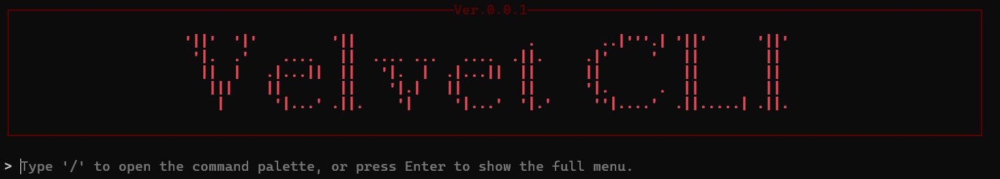

# VelvetCLI

VelvetCLI is a command-line tool designed to streamline Hytale mod development. With an interactive UI and automated workflows, it handles server authentication and mod building. You will eb able to quickly open your mod projects, sleect which ones you would want to build and run them with the server.

## Features

- **Hytale Server Setup**: Run and authenticate your Hytale server with ease.
- **Mod Managment**: Clone, build, and manage Hytale mods directly from the CLI.
- **Mod Build System**: Automatically detects and builds selected mods before server startup.


## Self-Build Installation

### Prerequisites

- .NET 9.0 SDK
- Git (for mod cloning)
- At least Java 21 - required to run hytale server

### Setup

1. Clone the repository:
   ```bash
   git clone https://github.com/VelvetSociety/VelvetCLI.git
   cd VelvetCLI
   ```
2. Build the standalone executable:
   ```bash
   dotnet publish -c Release -r win-x64 --self-contained true -p:PublishSingleFile=true
   ```
3. OPTIONAL Add the folder with velvet.exe to path, this will allow you to run 'velvet' from anywhere in the system


## Command Reference

### Workspace Commands

- `init`: Initializes the current directory as a Velvet workspace by creating the `mods` folder.

### Hytale Server Commands

- `auth`: Starts the Hytale server, runs authentication command to save authentication localy, opens the verification URL in your browser and closes the server. This simplifies the authentication process for the user. 
>Read more about Hytale authentication here: https://hytale.com/news/article/hytale-server-authentication-guide
- `server`: Runs the Hytale server with selected plugins and selected mods.
  - `server rebuild`: Forces a clean rebuild of all selected mods before launching the server.
> The HytaleServer jar is not included in this project. The CLI will look for it in the default location that Hytale is installed in.

> The CLI does not contain any gradle.build files. It relies on the mod folder containing the gradle.build files. If you are creating a new mod, you can use the mod template from Britakee: https://github.com/realBritakee/hytale-template-plugin which contain the gradle.build files and works with this CLI.

### Mod Management Commands

- `mod clone <github-url>`: Clones a Hytale mod repository from GitHub into your `mods` folder.
- `mod list`: Displays a list of all currently cloned mods.
- `mod select`: Opens an interactive multi-selection menu to toggle which mods are active for the next server run.
- `mod open [[mod-name]]`: Opens the specified mod (or prompts for selection) in your preferred IDE.
- `mod ide [[command|clear]]`: Configures your preferred IDE command (e.g., `code`) or clears it to use defaults. By default it uses `antigravity` then `code` then `intelij.exe`

### Utility Commands

- `exit`: Closes the application.

## Showcase
### Commands Palette

### Server Auth & Start

### Mod Open in IDE


## Mod Template
The mod template used in these screenshots is from https://github.com/realBritakee/hytale-template-plugin
by Britakee. They created a great starting point for plugin setup

## Support
This is a starter project, many things will change but the core functionality will remain. This CLI was mainly made for personal use, but I decided to share it with the community. If you have any suggestions or issues, feel free to open an issue or a pull request. Please provide feedback, it is always appreciated.

## License

This project is licensed under the MIT License - see the [LICENSE](LICENSE) file for details.